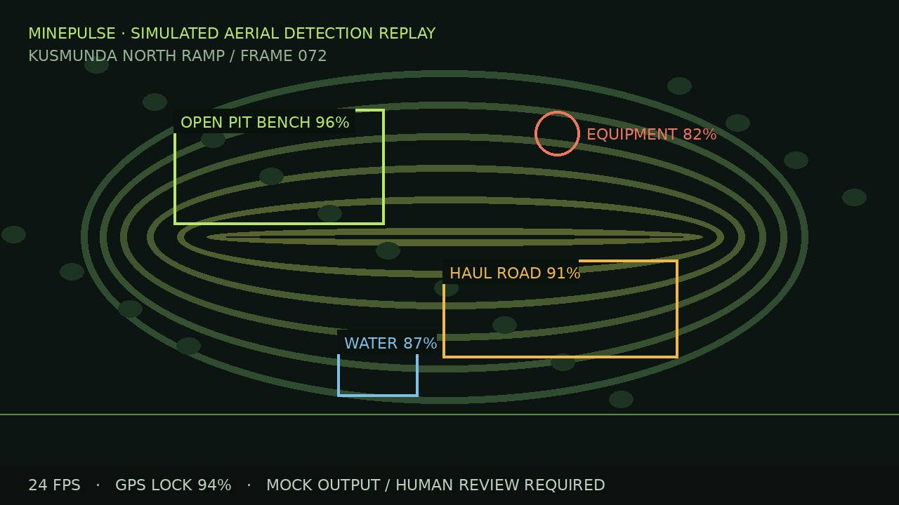
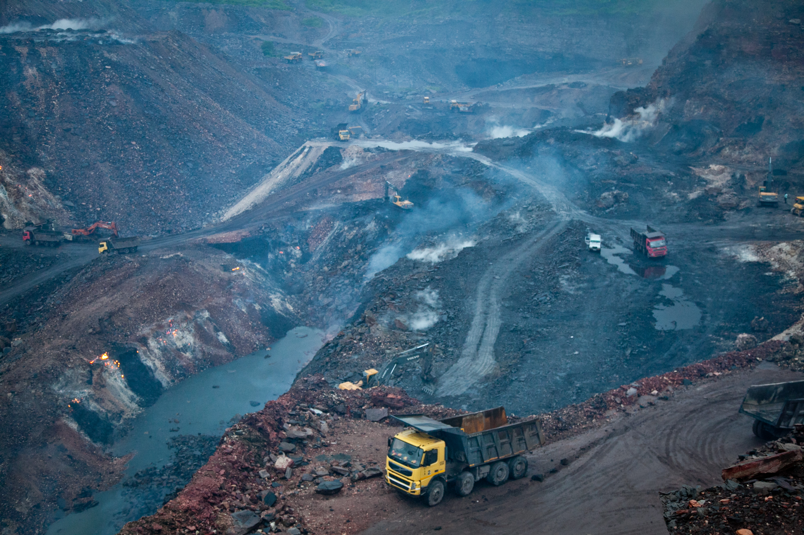
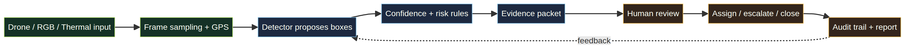
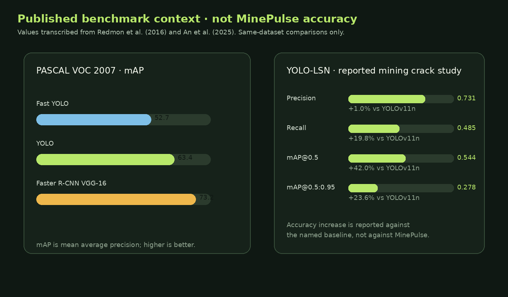
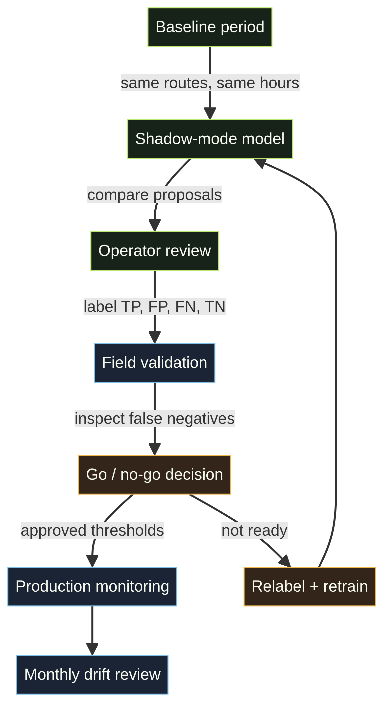

# MinePulse Command: Human-in-the-Loop Drone Intelligence for Coal-Mine Safety and Operations

**Research and product documentation · Manus AI · October 2026**

> **Evidence policy.** This document separates three categories of numbers: **published research measurements**, **MinePulse interface simulator values**, and **proposed production acceptance targets**. Only the first category is external evidence. The current MinePulse prototype has not trained or evaluated a mine-specific detector, so it does not claim a production accuracy or measured cost saving.

## Abstract

MinePulse Command is a coal-mine operations workspace for connecting drone or camera evidence to a human review workflow. It combines input staging, telemetry, detection proposals, risk rules, evidence packets, owner assignment, reports, and capacity planning. The design is intended for open-pit coal-mine operations where remote observation can reduce unnecessary exposure and make field evidence easier to review.

The current product preview includes a self-contained simulated aerial replay. It draws bounding boxes and circles around an open-pit bench, haul-road edge, water pocket, and mobile equipment. The interface also demonstrates live-stream controls, file validation, evidence review, timeline history, scalability planning, and transparent costing. These values are labelled as simulated.

The research basis is a combination of official mining safety sources, an open-pit mine detection dataset, the original YOLO real-time detection paper, a 2025 mining-induced crack detection study, and a 2025 field demonstration of autonomous UAV gas monitoring after a real underground blast. The literature shows that real-time visual detection and autonomous inspection are feasible, but it does not validate MinePulse’s mock outputs. [1] [2] [3] [4] [5] [6]

## 1. Project visual context

*Figure 1. Open-pit mine in Jharia, India. Photograph by international accountability project, licensed CC BY 2.0. This image is contextual and is not used as MinePulse training data. [7]*

MinePulse is designed around a simple operating chain:

*Figure 2. Proposed evidence loop. The deployed system should preserve provenance from input frame to human decision and audit trail.*

## 2. Introduction

A mine produces more evidence than a single inspection team can comfortably review: aerial imagery, haul-road conditions, bench geometry, water accumulation, dust, equipment movement, attendance, contractor records, observations, and corrective actions. The operational challenge is converting that evidence into an accountable sequence:

> **Detect → verify → assign → close**

MinePulse focuses on coal mines and uses demonstration records for Kusmunda, Gevra OC, Dipka OC, Jayant, Nigahi, and Sohagpur. These records are mock examples and must be replaced with authorised mine data before production use.

Mining-safety analysis needs both technology and context. MSHA publishes mine employment, production, fatality, injury, citation, and order information, while NIOSH provides mining safety and health research and statistics. These sources support the importance of better evidence workflows, but they do not provide a causal estimate for MinePulse. [1] [2]

## 3. Existing work and evidence base

### 3.1 Official safety and operating context

| Source | What it contributes | What it does not prove for MinePulse |
|---|---|---|
| MSHA statistics | Public mine employment, production, fatality, injury, citation, and order data | A MinePulse-specific reduction in incidents or citations |
| NIOSH Mining Program | Research context for worker safety, health, and mining technology | That a particular UI or detector is safe to deploy |
| Field UAV study | Demonstrated an autonomous UAV mission approximately 40 minutes after a real underground blast to measure gases and inspect changes | A general detection accuracy or business-case saving for every mine |
| Open-pit detection dataset | Remote-sensing images with hand-annotated JSON bounding boxes under CC BY 4.0 | Sufficient coverage of Indian coal-mine cameras, weather, classes, or operating policy |

The UAV field study is especially relevant to the product concept. It reports deployments in harsh mining environments and a post-blast mission that measured gas concentrations and visual changes. The authors also identify dust and smoke as unresolved challenges. [6]

### 3.2 Object detection benchmark context

The original YOLO paper reported 45 frames per second and 63.4% mAP on Pascal VOC 2007 for YOLO, while Fast YOLO reported 155 FPS and 52.7% mAP. Faster R-CNN VGG-16 reported 73.2% mAP at 7 FPS in the same comparison table. These are historical general-object benchmarks, not coal-mine results. [4]

*Figure 3. Published benchmark context. The chart intentionally does not include MinePulse as an accuracy bar because the prototype has no trained detector evaluation.*

### 3.3 Mine-specific detection research

A 2025 Scientific Reports study evaluated YOLO-LSN on a self-built mining-induced surface-crack dataset and on VisDrone2019. On the self-built crack dataset, the reported YOLO-LSN precision was 0.731, recall was 0.485, mAP@0.5 was 0.544, and mAP@0.5:0.95 was 0.278. The paper reports that YOLO-LSN improved mAP@0.5 by 135.5% relative to Faster R-CNN and 160.3% relative to SSD on that dataset. On VisDrone2019, the reported mAP@0.5 was 0.422 versus 0.383 for YOLOv11n, and mAP@0.5:0.95 was 0.249 versus 0.225. [5]

Those increases are **relative comparisons within the cited experiments**. They are not a claim that MinePulse improved accuracy by 135.5%, because MinePulse has not trained or evaluated YOLO-LSN or any other detector.

## 4. System architecture

### Tech stack

| Layer | Current implementation | Production hardening required |
|---|---|---|
| Frontend | React, TypeScript, Vite, Wouter, Lucide, Sonner | Accessibility audit, code splitting, browser support matrix |
| Operations UI | Overview, field operations, compliance, reports, drone command, scalability, costing | Role-based views and permission-aware actions |
| Media input | Simulator, uploaded video staging, RGB camera, thermal mode, stream endpoint validation | Authenticated WebRTC/HLS gateway, resumable uploads, malware scanning |
| Data | Supabase client paths plus populated local demo mode | Row-level security, retention policy, immutable audit records, backups |
| Detection | Current replay and mock outputs | Mine-specific trained model, calibration, monitoring, rollback |
| Deployment | Static Vite deployment on Vercel; Render manifest retained | CI checks, dependency scanning, observability, secret rotation |

## 5. Methodology

### 5.1 Product methodology

MinePulse keeps the operator in the decision loop. An input is staged, a detector or simulator proposes a finding, risk rules add severity and context, evidence is attached, and a responsible human assigns, escalates, or closes the work. The new contextual drawer changes its content based on record type:

- Field inspections show field readiness, review completion, shift timeline, and handover.
- Compliance reviews show DGMS evidence, responsible owner, readiness score, and follow-up status.
- Risks show threshold crossing, escalation confidence, linked evidence, and safety ownership.
- Reports show source synchronization, evidence coverage, and dispatch readiness.

### 5.2 Proposed ML training methodology

The current prototype has **no trained or fine-tuned model**. A production programme should use the following sequence:

1. Define classes and decision policy. Candidate classes include open-pit bench, haul-road edge, water pocket, dust plume, mobile equipment, worker, restricted zone, and berm defect.
2. Collect mine-specific RGB and thermal footage across altitude, weather, season, daylight, camera, and mine phase.
3. Annotate boxes or polygons, plus occlusion, blur, small-object, ambiguity, and site identifiers.
4. Split by site and time, not only by random frame. A random frame split can leak near-identical frames from the same flight into both training and test sets.
5. Fine-tune a compact real-time detector from a pretrained checkpoint only after establishing a baseline.
6. Report precision, recall, F1, mAP@0.5, mAP@0.5:0.95, false negatives per flight hour, latency, throughput, and calibration.
7. Run shadow mode beside existing inspection practice and send every safety-relevant false negative to a second reviewer.
8. Release by mine and camera type, with model versioning, drift monitoring, rollback, and a documented safety case.

### 5.3 How accuracy should be measured

For a selected IoU threshold, a predicted box is a true positive when it matches a labelled object at or above that threshold and class. The basic metrics are:

| Metric | Formula / interpretation | Why it matters in a mine |
|---|---|---|
| Precision | TP / (TP + FP) | How often an alert is correct; low precision creates alert fatigue |
| Recall | TP / (TP + FN) | How many labelled hazards were found; low recall hides risk |
| F1 | 2 × precision × recall / (precision + recall) | Balanced summary when precision and recall both matter |
| AP | Area under the precision–recall curve for one class | Compares performance across confidence thresholds |
| mAP@0.5 | Mean AP at IoU 0.5 across classes | Easier-to-localise benchmark view |
| mAP@0.5:0.95 | Mean AP across IoU thresholds 0.5 to 0.95 | Stricter localisation and robustness view |
| Latency | Time from frame arrival to displayed proposal | Determines whether an operator can act in time |
| False negatives / flight hour | Missed labelled hazards divided by flight hours | More operationally meaningful than accuracy alone |

The test set should be held out by mine or flight. Report confidence intervals through bootstrap resampling by flight, not by individual frame, because neighbouring video frames are correlated.

## 6. Results and numbers

### 6.1 Published research results

| Study / dataset | Model or comparison | Precision | Recall | mAP@0.5 | mAP@0.5:0.95 | Speed / other result |
|---|---|---:|---:|---:|---:|---|
| Pascal VOC 2007 [4] | Fast YOLO | — | — | 0.527 | — | 155 FPS |
| Pascal VOC 2007 [4] | YOLO | — | — | 0.634 | — | 45 FPS |
| Pascal VOC 2007 [4] | Faster R-CNN VGG-16 | — | — | 0.732 | — | 7 FPS |
| Mining-induced surface cracks [5] | YOLO-LSN | 0.731 | 0.485 | 0.544 | 0.278 | 2.3M parameters |
| Same crack dataset [5] | Faster R-CNN baseline | 0.387 | 0.270 | 0.231 | — | Baseline |
| Same crack dataset [5] | SSD baseline | 0.355 | 0.247 | 0.209 | — | Baseline |
| VisDrone2019 [5] | YOLO-LSN | 0.539 | 0.408 | 0.422 | 0.249 | Lightweight comparison |
| VisDrone2019 [5] | YOLOv11n comparison | 0.513 | 0.369 | 0.383 | 0.225 | Same study |

### 6.2 What “accuracy increased” means in the cited study

| Comparison | Metric | Absolute change | Relative change | Measurement basis |
|---|---|---:|---:|---|
| YOLO-LSN vs Faster R-CNN | Precision | +0.344 | +88.9% | Same self-built mining-crack test set |
| YOLO-LSN vs Faster R-CNN | Recall | +0.215 | +79.6% | Same self-built mining-crack test set |
| YOLO-LSN vs Faster R-CNN | mAP@0.5 | +0.313 | +135.5% | Same self-built mining-crack test set |
| YOLO-LSN vs SSD | mAP@0.5 | +0.335 | +160.3% | Same self-built mining-crack test set |
| YOLO-LSN vs YOLOv11n | Precision | +0.026 | +5.1% | VisDrone2019 comparison |
| YOLO-LSN vs YOLOv11n | Recall | +0.039 | +10.6% | VisDrone2019 comparison |
| YOLO-LSN vs YOLOv11n | mAP@0.5 | +0.039 | +10.2% | VisDrone2019 comparison |
| YOLO-LSN vs YOLOv11n | mAP@0.5:0.95 | +0.024 | +10.7% | VisDrone2019 comparison |

The relative change is calculated as `(new value − baseline value) / baseline value × 100`. The study used a one-time 80% training, 10% validation, and 10% test split, with 640×640 images, 600 epochs, batch size 8, and Adam optimisation. [5] Because the study did not use cross-validation and the mine-specific dataset is not MinePulse data, its results should be treated as research evidence, not a deployment guarantee.

### 6.3 MinePulse prototype results

| Prototype area | Current value | Status | How it was produced |
|---|---:|---|---|
| Detection classes in Overview replay | 4 | Simulated | Deterministic synthetic video with labelled overlays |
| Displayed confidence values | 82–96% | Simulated | UI demonstration values, not calibrated probabilities |
| Stream latency | 184 ms | Simulated | Dashboard placeholder telemetry |
| Route coverage | 96.2% | Simulated | Dashboard placeholder telemetry |
| Monthly cost scenario | ₹184,000 | Planning scenario | Adjustable mock model: 2 drones, 6 mines, 8 hours/day |
| Accuracy increase versus baseline | Not measured | Not claimed | No mine-specific model or labelled test set exists yet |

The prototype intentionally does not report precision, recall, mAP, or accuracy. Presenting a number without a labelled held-out mine test set would be misleading.

## 7. Impact measurement

### 7.1 What impact should be measured

*Figure 4. Evaluation loop for moving from a populated prototype to a validated production system.*

| Impact question | Baseline | Production comparison | Evidence required |
|---|---|---|---|
| Does review become faster? | Median minutes from footage arrival to triage decision | Same route and shift with MinePulse | Timestamped audit events, stratified by severity |
| Are critical findings escalated sooner? | Time from observation to owner acknowledgement | MinePulse workflow with human approval | Event logs and critical-finding sample |
| Are fewer hazards missed? | Competent-person finding set | Model proposal plus human review | Flight-level recall and false negatives/hour |
| Is evidence more complete? | Proportion of reports with missing location, owner, or attachment | MinePulse evidence packet completion | Required-field audit |
| Is exposure reduced? | People-hours spent in hazard-adjacent inspection | Remote review plus controlled field validation | Exposure log and task-level safety review |
| Is the system economical? | Cost per flight hour and review hour | Compute, connectivity, storage, and labour cost | Finance-approved cost model |

### 7.2 Real-world evidence versus scenario estimates

The autonomous UAV field study reports a mission approximately 40 minutes after a real underground blast, with gas measurements and visual inspection in harsh conditions. That is evidence of feasibility for autonomous inspection and sensing, not a MinePulse impact estimate. [6]

The MinePulse interface currently shows scenario values of **18–27% less manual review time**, **2.4× faster simulated escalation**, and **30 days of hot evidence retention**. These are product-planning assumptions. They must be replaced by a pre/post or controlled field study before being presented as impact.

A defensible impact study should use a baseline period, the same mine routes and shift patterns, a shadow-mode detector, flight-level sampling, and a pre-registered set of primary measures. Confidence intervals should be reported, and improvement should be shown both in absolute units and relative percentages.

## 8. Challenges and limitations

The prototype does not establish safety compliance, detection accuracy, or cost savings. The replay is synthetic. Mine names, GPS points, findings, and metrics are demonstration records. Browser-side camera and file inputs do not yet guarantee a production-grade media pipeline, durable object storage, or authenticated multi-user access.

Model performance can fall in dust, smoke, rain, glare, night scenes, small targets, occlusion, camera vibration, and changing mine benches. A high confidence score is not proof of a safe condition. Human approval, competent-person judgement, statutory inspection, operator training, and emergency procedures remain necessary.

Published model numbers are not directly comparable across datasets, classes, camera conditions, or train/test splits. The 135.5% mAP increase reported for YOLO-LSN is a comparison within one mining-crack study. It cannot be transferred to haul-road, equipment, water, or coal-face detection without new data.

## 9. Future scope

The next technical milestone is a one-mine shadow-mode pilot. It should connect an authenticated video gateway, collect flight-level metadata, store immutable evidence packets, and label false positives and false negatives with a second reviewer. A mine-specific model card should report class definitions, training data, split policy, precision, recall, mAP, latency, false negatives per flight hour, and known failure modes.

Further modules can cover slope movement, ventilation, methane, dust concentration, worker proximity, blasting exclusion zones, and predictive maintenance. The platform should support model versioning, threshold approvals, drift monitoring, rollback, access controls, backup restoration, and an independent safety review before automated routing is enabled.

## 10. Conclusion

MinePulse Command provides a visual and operational foundation for coal-mine evidence review. Its current strength is not an unverified accuracy claim. It is the connection between media input, transparent mock detection output, human review, accountable action, timeline history, scalability planning, and cost assumptions.

The research evidence supports the direction: real-time object detection can operate at useful speeds, mine-specific research can improve precision, recall, and mAP against named baselines, and autonomous UAVs have been demonstrated in harsh mine environments. The responsible next step is to measure MinePulse itself using a mine-specific labelled dataset and flight-level impact protocol.

## References

[1]: https://www.msha.gov/data-and-reports/statistics "Mine Safety and Health Administration statistics"

[2]: https://www.cdc.gov/niosh/mining/ "National Institute for Occupational Safety and Health Mining Program"

[3]: https://doi.org/10.6084/m9.figshare.27300960 "Open Pit Mine Object Detection Dataset"

[4]: https://arxiv.org/html/1506.02640v5 "You Only Look Once: Unified, Real-Time Object Detection"

[5]: https://www.nature.com/articles/s41598-025-14880-6 "Research on UAV aerial imagery detection algorithm for mining-induced surface cracks based on improved YOLOv10"

[6]: https://doi.org/10.1002/rob.22500 "Safety inspections and gas monitoring in hazardous mining areas shortly after blasting using autonomous UAVs"

[7]: https://commons.wikimedia.org/wiki/File:Open_pit_mine_in_Jharia.jpg "Open pit mine in Jharia, Wikimedia Commons, CC BY 2.0"

### Visual asset notes

- The MinePulse detection replay poster and video are original synthetic prototype assets stored in `client/public/media/`.
- The evidence-loop, measurement-loop, and benchmark chart are original documentation visualisations created for this report from the cited values.
- The Jharia photograph is reproduced under CC BY 2.0 with attribution to international accountability project and a link to the licence. It is contextual imagery, not training data.
